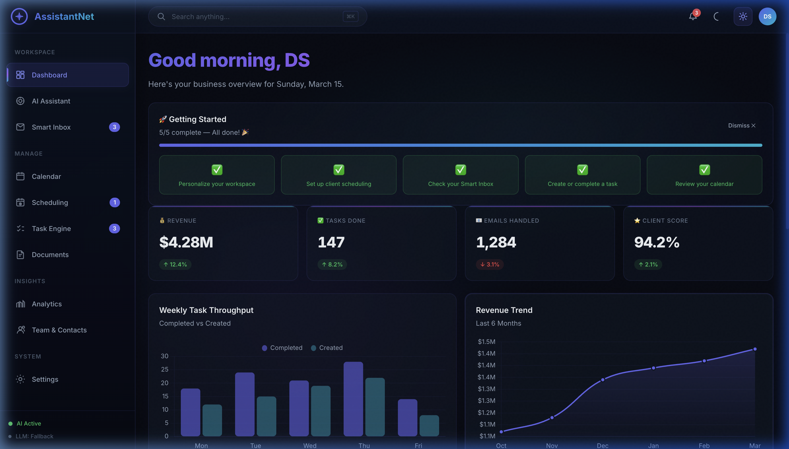
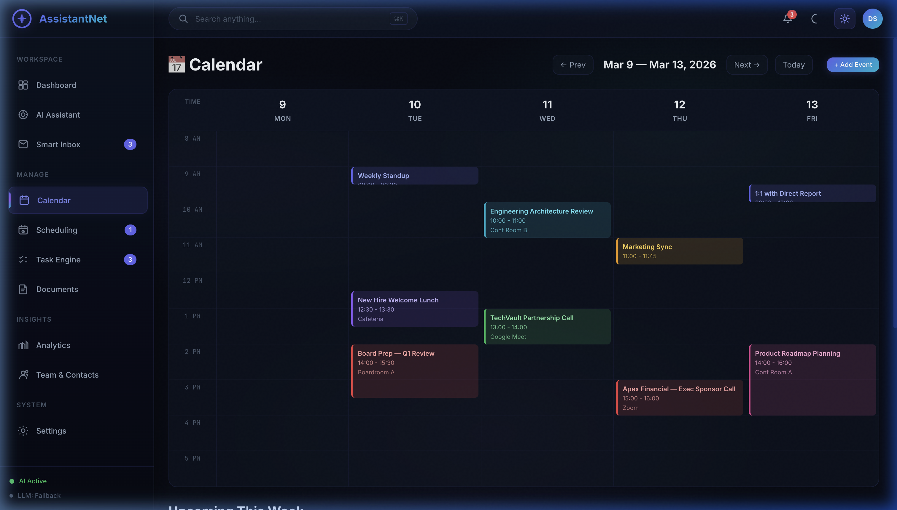
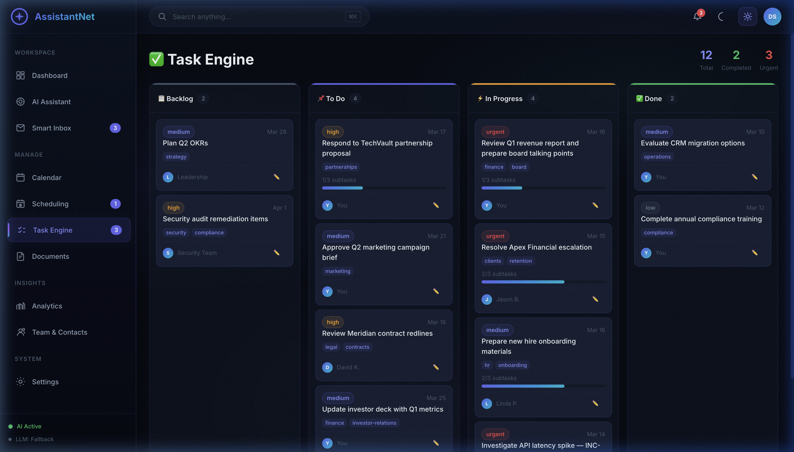
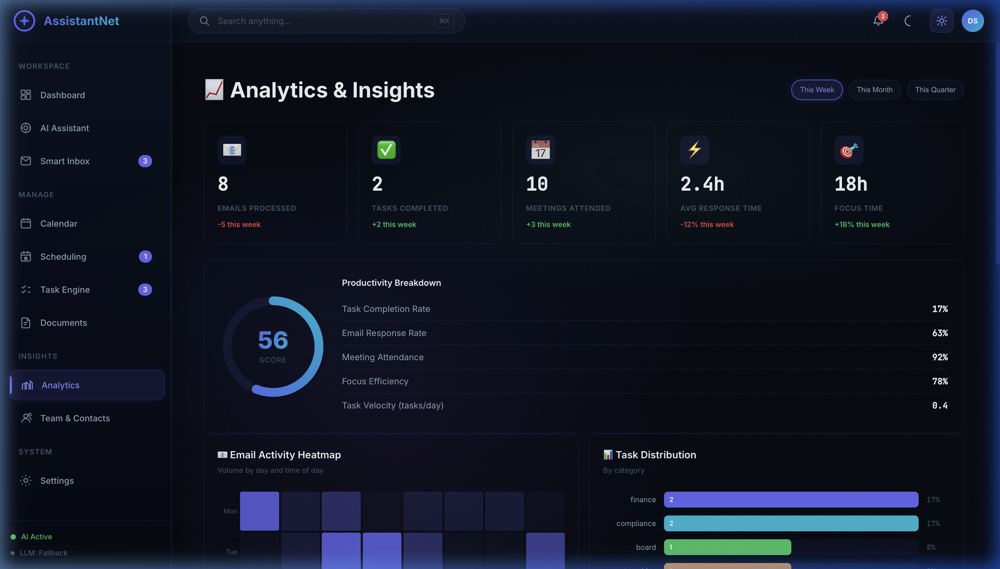
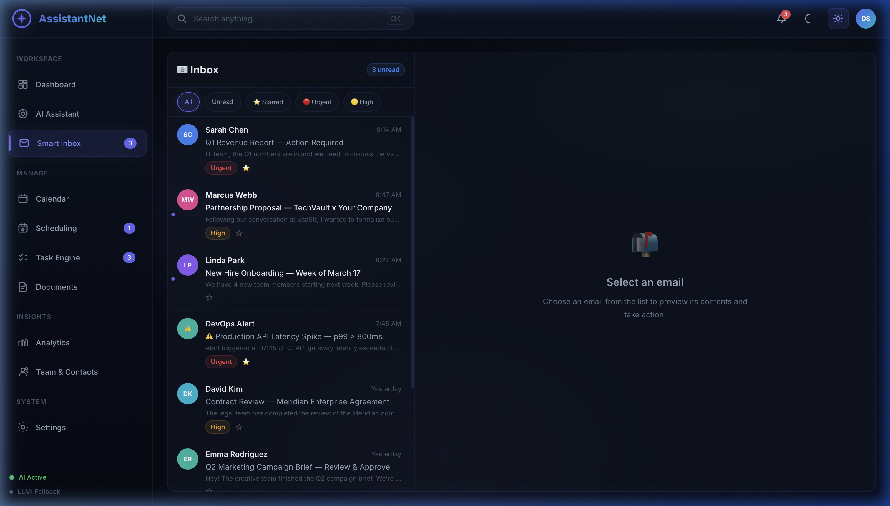
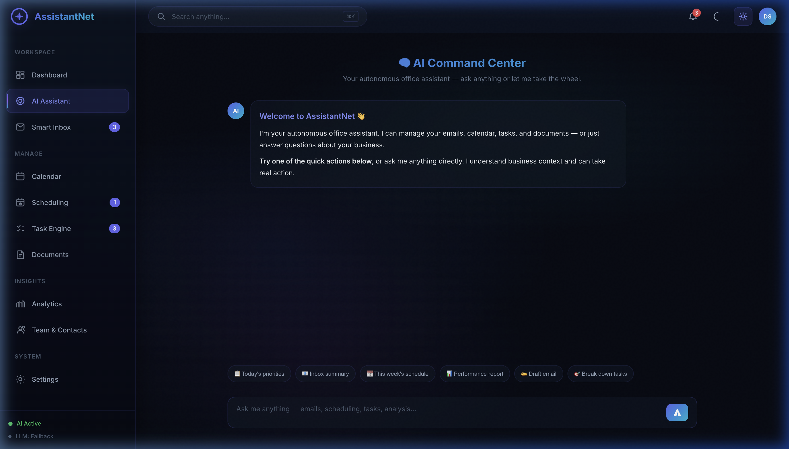
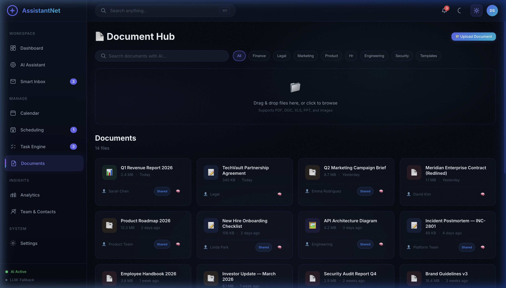
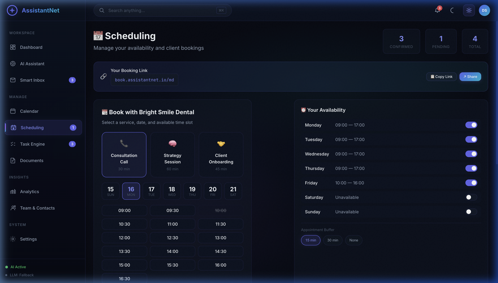

# AssistantNet

> **Status: Working Full-Stack Demo** — 11 interactive modules, real Gemini LLM chat, Express + SQLite backend, and localStorage fallback. Business data (emails, meetings, KPIs) is **seeded** but fully interactive — all CRUD, AI actions, and scheduling work end-to-end.

AI-powered autonomous office assistant portal. Designed to manage emails, calendar, tasks, documents, and analytics with intelligent workflow automation.

## Screenshots

| Dashboard | Calendar |
|---|---|
|  |  |

| Task Engine | Analytics |
|---|---|
|  |  |

| Smart Inbox | AI Assistant |
|---|---|
|  |  |

| Documents | Scheduling |
|---|---|
|  |  |

## Features

#### What's Real
- **🧠 AI Chat** — Streaming Gemini 2.0 Flash integration with business-context injection (falls back to rich built-in responses without API key)
- **✅ Task Engine** — Kanban board with working drag-and-drop, subtask progress bars, full CRUD (add/edit/delete), and localStorage persistence
- **📧 Inbox UI** — Star/unstar, filter by priority, mark-as-read, email preview pane, AI "Draft Reply" and "Summarize" call the LLM
- **📊 Dashboard** — Live Chart.js rendering (bar + line charts), KPI cards with animated counters, activity feed
- **📅 Calendar** — Weekly time-grid with color-coded events, week navigation, and full CRUD (add/edit/delete events via modals)
- **📄 Documents** — Search, category filter, file cards with type icons, working file upload (button + drag-and-drop), template generation
- **📆 Scheduling** — Booking management with business-specific appointment types and time slots
- **⚙️ Settings** — Business type selector, user profile, API key config, theme toggle, autonomous mode
- **🏢 Business Types** — Dental, restaurant, barber, and gym presets that configure KPIs, labels, booking types, and seed data
- **🔌 Design System** — 60+ CSS variables, 15+ animations, glassmorphism, full responsive breakpoints

#### Visual Design
- **🎨 Aurora mesh background** — Animated gradient backdrop with grain texture overlay
- **🪟 Glassmorphism** — Frosted sidebar and top-bar with `backdrop-filter` blur
- **✨ Micro-interactions** — KPI shimmer sweep on hover, button shimmer, icon scale effects, nav slide
- **📊 Animated KPI counters** — Numbers count up with easeOutQuart curve on dashboard load
- **🌈 Gradient accents** — Warm tri-color gradients on active nav indicator with glow pulse
- **🔔 Toast progress bar** — Auto-countdown strip with close button on notifications
- **⌨️ ⌘K shortcut badge** — Keyboard hint in the global search bar
- **🌙 Full theme support** — Dark and light mode with all effects adapting correctly

#### What's Simulated
- **Seed data only** — Emails, meetings, KPIs, and activity feed start with hardcoded data (but all user actions are real and persisted)
- **No live integrations** — Not connected to Gmail, Google Calendar, Slack, or any external APIs
- **Autonomous mode** — Workflow engine architecture exists and processes actions, but no real external actions are taken
- **Notifications** — Bell icon shows a real notification panel, but notifications are derived from data rather than push-based

## Quick Start

```bash
npm install
npm run dev
```

## LLM Integration

AssistantNet works out of the box with rich built-in responses (no API key required). To enable live Gemini streaming:

1. Go to **Settings → AI Configuration**
2. Enter your API key from [Google AI Studio](https://aistudio.google.com/)
3. Click **Test Connection** to verify
4. Uses `gemini-2.0-flash` with a business-tuned system prompt

## Tech Stack

- **Vite 6** — Build tool with HMR
- **Vanilla JS** — Zero framework, ES modules, hash-based SPA router
- **Express 5 + SQLite** — Backend API with auth (optional, falls back to localStorage)
- **Chart.js 4** — Bar + line chart analytics
- **Marked 15** — Markdown rendering in chat
- **Google GenAI SDK** — Streaming Gemini integration (lazy-loaded to avoid Vite hang)
- **localStorage** — Client-side data persistence via `DataStore` class

---

## Architecture

| Layer | Files | Purpose |
| --- | --- | --- |
| Entry | `index.html`, `main.js`, `router.js`, `vite.config.js` | Shell, routing, top-bar, keyboard shortcuts |
| Services | `data.js`, `llm.js`, `workflow.js`, `utils.js`, `api.js` | Data store, LLM streaming, autonomous queue, utilities |
| Modules | 11 × (`module.js` + `module.css`) | Dashboard, Assistant, Inbox, Calendar, Tasks, Documents, Scheduling, Settings, Analytics, Contacts, Command Palette |
| Styles | `variables.css`, `layout.css`, `components.css` | Design system tokens, layout, reusable components |
| Backend | `server/index.js`, `server/auth.js`, `server/db.js` | Express API, JWT auth, SQLite persistence |

---

## Roadmap

### ✅ Phase 1 — Bug Fixes & Polish (v1.1)

- [x] Fix double `init()` call race condition
- [x] Fix calendar `formatHour(12)` → "0 PM" bug
- [x] Fix sidebar rebuild on every nav change
- [x] Wire inbox Summarize button to LLM
- [x] Import `marked` once at stream start, not per-chunk
- [x] Add 404/unknown route handling
- [x] Replace `window.prompt()` with modal for task creation

### ✅ Phase 2 — Settings & LLM Activation (v1.2)

- [x] Settings page with API key input, user name, company name, business type
- [x] LLM connection status indicator in sidebar
- [x] Autonomous mode toggle wired to workflow engine
- [x] Calendar CRUD — add, edit, delete events via modals
- [x] Document templates create real documents
- [x] Upload button triggers native file picker
- [x] Remove duplicate utility functions

### 🔲 Phase 3 — Real Integrations (v2.0)

- [ ] Gmail API integration (OAuth2, real email send/receive)
- [ ] Google Calendar API (read/write events)
- [ ] Real file upload to cloud storage
- [ ] Cross-module search
- [ ] Push notification system

### 🔲 Phase 4 — Backend & Auth (v3.0)

- [ ] User authentication (Google OAuth / SSO)
- [ ] PostgreSQL replacing localStorage
- [ ] Role-based access control
- [ ] Webhook integrations (Slack, Teams)

### 🔲 Phase 5 — Autonomous Intelligence (v4.0)

- [ ] Workflow engine connected to live APIs
- [ ] AI-generated daily briefings
- [ ] Smart scheduling with calendar pattern analysis
- [ ] Email auto-drafting with approval queue
- [ ] Real KPI tracking from integrated data sources

